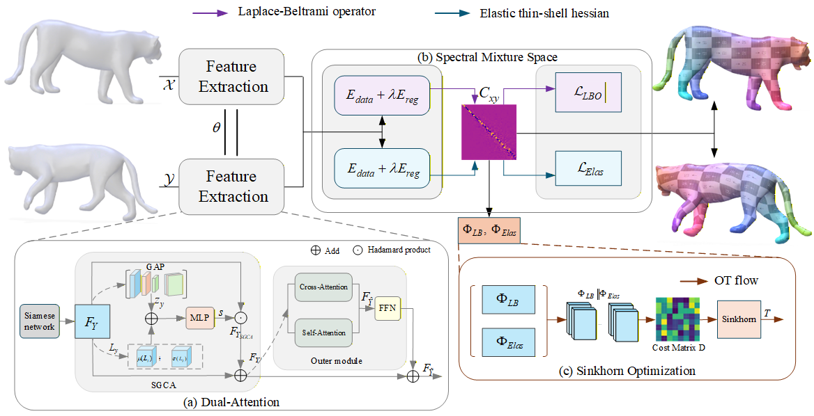

# [Hybrid Modal Functional Maps with Dual Attention for Robust Deformable Shape Matching](https://hybridfmaps.github.io)




## Installation
Please follow the installation instructions from: [Thin shell energy](https://gitlab.com/numod/shell-energy)
```bash 
# create new virtual environment
conda env create --name sgcafmaps -f environment.yml

conda activate sgcafmaps
```


## Dataset
The training and testing datasets employed in this work can be obtained from the [ULRSSM repository](https://github.com/dongliangcao/Unsupervised-Learning-of-Robust-Spectral-Shape-Matching/) by Dongliang Cao et al. Please refer to the instructions provided in the repository for downloading and organizing the datasets under the `../data/`.
```Shell
├── data
    ├── FAUST_r
    ├── SCAPE_r
    ├── SHREC19_r
    ├── TOPKIDS
    ├── SMAL_r

```
We sincerely acknowledge the original authors for sharing these valuable datasets, and attribute full credit to the respective contributors for their efforts in advancing shape analysis research.
## Data preparation
For data preprocessing, we provide *[preprocess.py](preprocess.py)* to compute all things we need.
Here is an example for FAUST_r.
```python
python preprocess.py --data_root ../data/FAUST_r/ --no_normalize --n_eig 200
```

## Train
To train a specific model on a specified dataset.
```python
python train.py --opt options/train/faust.yaml
```
You can visualize the training process in tensorboard or via wandb.
```bash
tensorboard --logdir experiments/
```

## Test
To test a specific model on a specified dataset.
```python
python test.py --opt options/test/faust.yaml
```
The qualitative and quantitative results will be saved in [results](results) folder.

<!-- ## Texture Transfer
An example of texture transfer is provided in *[texture_transfer.py](texture_transfer.py)*
```python
python texture_transfer.py
``` -->

## Visualization
Make sure to install the latest [polyscope](https://github.com/nmwsharp/polyscope-py) to allow headless rendering.

To visualize the final results.
```python
python visualize.py --opt options/test/faust.yaml
```
The visualized images will be saved in [results](results) folder.
## Pretrained models
You can find all pre-trained models in [checkpoints](checkpoints) for reproducibility.

## Acknowledgement
We thank Bastian et al. for proposing [Hybrid Functional Maps for Crease-Aware Non-Isometric Shape Matching](https://github.com/xieyizheng/hybridfmaps), upon which our code is built.

We also thank Cao et al. for their work [Unsupervised Learning of Robust Spectral Shape Matching](https://github.com/dongliangcao/Unsupervised-Learning-of-Robust-Spectral-Shape-Matching), which provided the foundation for our dataset setup.

We are grateful to Le et al. for introducing [Integrating Efficient Optimal Transport and Functional Maps for Unsupervised Shape Correspondence Learning](https://github.com/Tungthanhlee/EOT-Correspondence), from which we drew inspiration for the optimal transport module in our post-processing step.

We also acknowledge the contributions of Attaiki through[ DPFM: Deep Partial Functional Maps](https://github.com/pvnieo/DPFM) and the SHARP team for [DiffusionNet](https://github.com/nmwsharp/diffusion-net), both of which offered valuable insights for our experiments.


